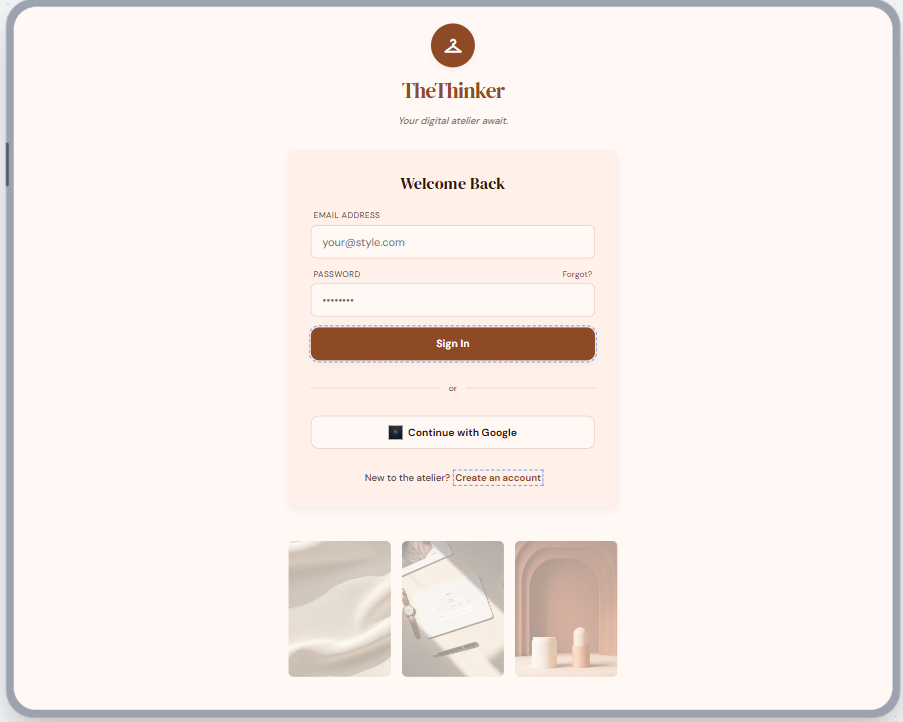
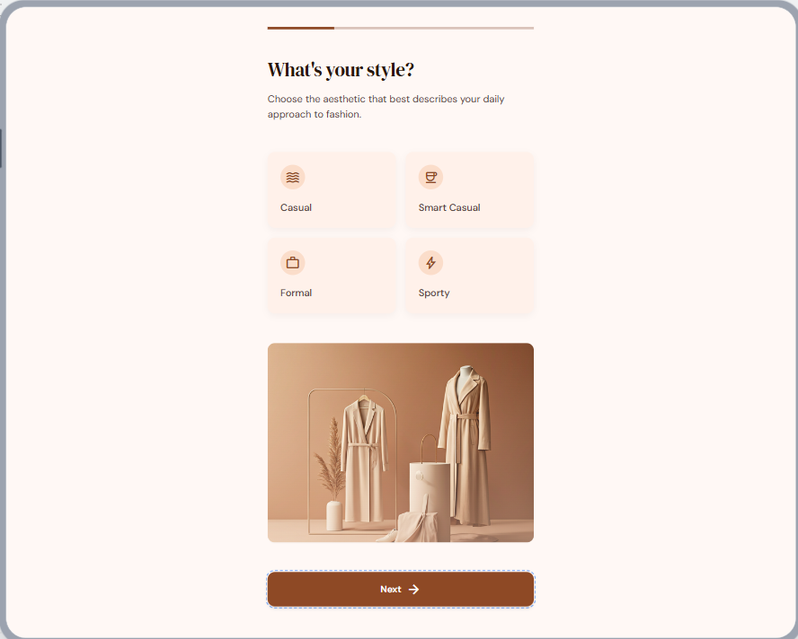
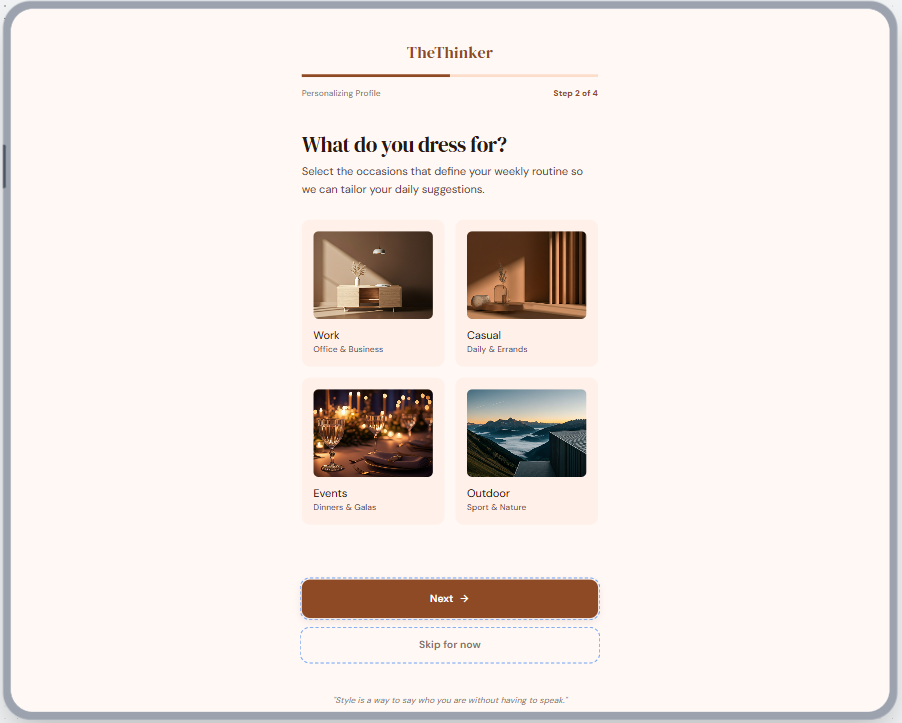
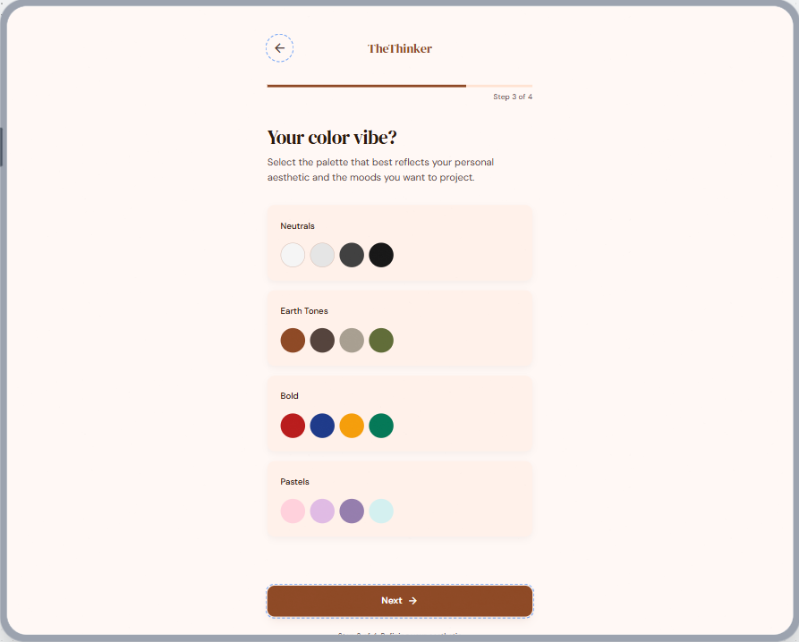
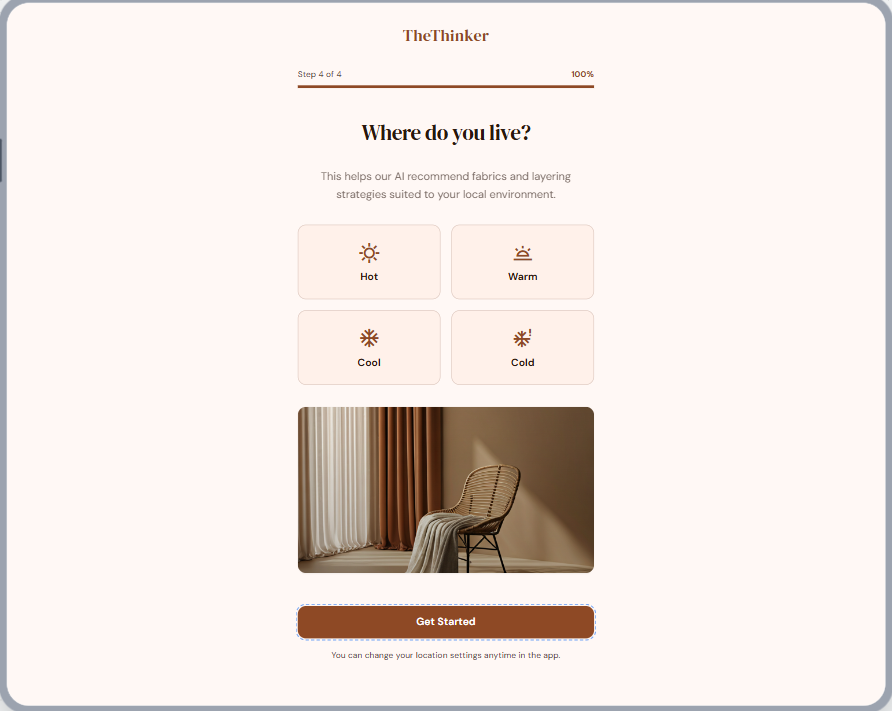
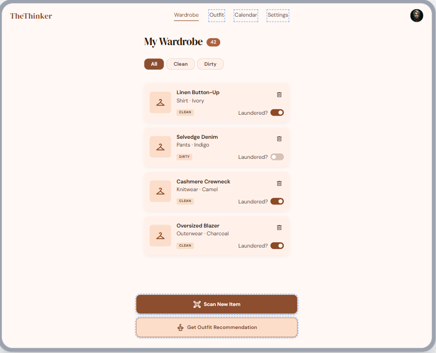
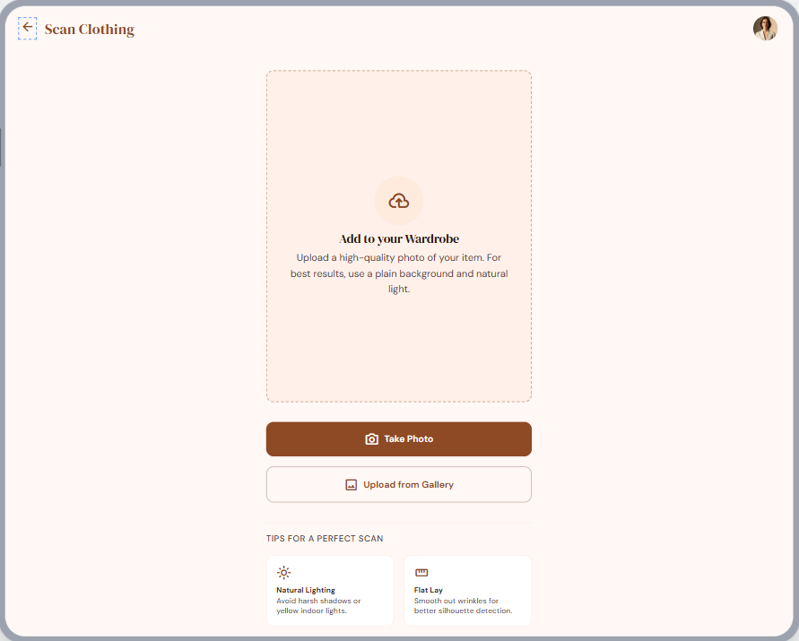
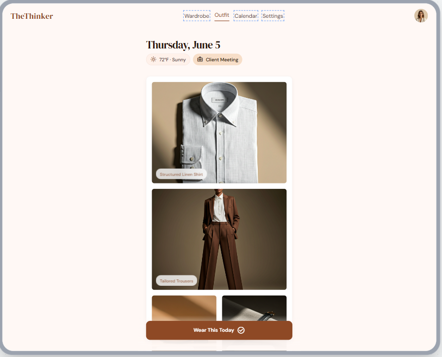
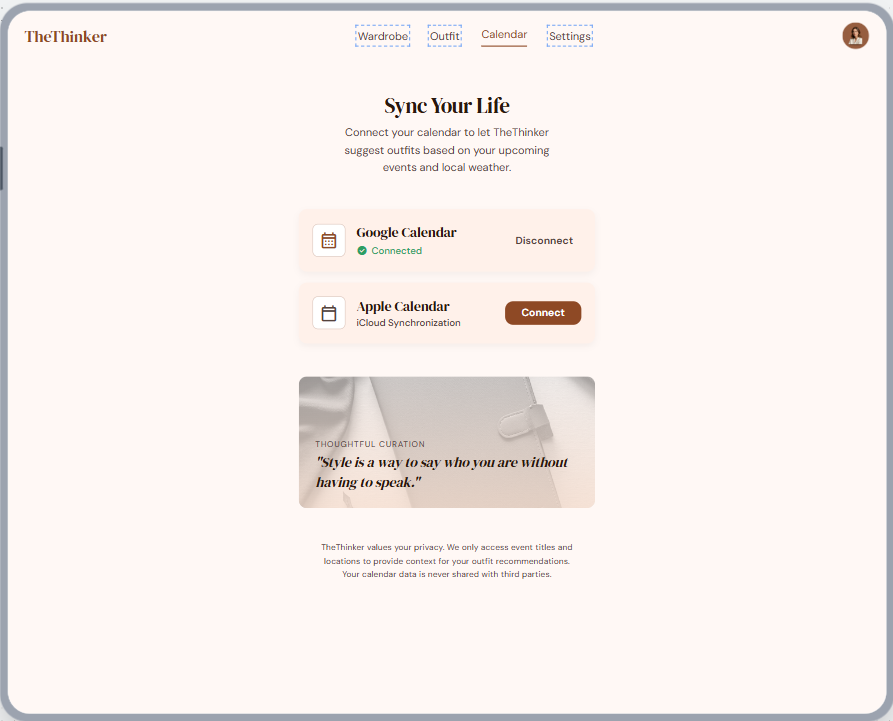
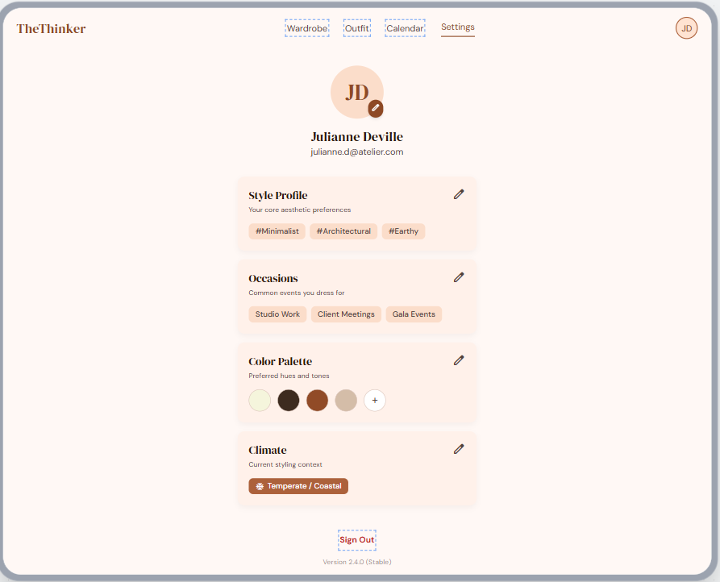

# TheThinker Design System

A warm & earthy mobile-first outfit recommendation app.

**Stitch source:** https://stitch.withgoogle.com/projects/1555275230298263015

---

## Screen Map

| Screen | Route | File | Status |
|---|---|---|---|
| Login | `/login` | `features/auth/components/LoginPage.tsx` | Exists — design mismatches |
| Register | `/register` | `features/auth/components/RegisterPage.tsx` | KAN-12 (not merged) |
| Onboarding — Style | `/onboarding` step 1 | `features/onboarding/components/OnboardingPage.tsx` | Exists |
| Onboarding — Occasions | `/onboarding` step 2 | same | Exists |
| Onboarding — Color Vibe | `/onboarding` step 3 | same | Exists |
| Onboarding — Climate | `/onboarding` step 4 | same | Exists |
| Wardrobe | `/wardrobe` | `features/wardrobe/components/WardrobePage.tsx` | Exists |
| Scan | `/wardrobe/scan` | `features/wardrobe/components/ScanPage.tsx` | Exists |
| Outfit | `/outfit` | `features/outfit/components/OutfitPage.tsx` | Exists |
| Calendar | `/calendar` | `features/calendar/components/CalendarPage.tsx` | Exists |
| Settings | `/settings` | `features/settings/components/SettingsPage.tsx` | Exists |

### Not Yet Implemented
- Google OAuth — "Continue with Google" on Login screen
- Register page design (inferred from Login "Create an account" link)
- Real wardrobe item photos (currently placeholders)

---

## Color Palette

### Brand Colors

| Token | Variable | Hex | Usage |
|-------|----------|-----|-------|
| Cream | `--cream` | `#FFFAF5` | Page background |
| Linen | `--linen` | `#F0E4D6` | Cards, secondary backgrounds |
| Sand | `--sand` | `#D4BDA8` | Borders, muted accents |
| Terracotta | `--terracotta` | `#C1714A` | Primary actions, CTAs |
| Rust | `--rust` | `#8B4E2F` | Hover states, accent |
| Espresso | `--espresso` | `#3D2B1F` | Text, headings |

Tailwind utilities auto-generated: `bg-cream`, `text-terracotta`, `border-sand`, etc.

### Semantic Tokens

| Token | Maps to | Usage |
|-------|---------|-------|
| `--background` | Cream | Page background |
| `--foreground` | Espresso | Body text |
| `--primary` | Terracotta | Primary interactive elements |
| `--primary-foreground` | Cream | Text on primary elements |
| `--secondary` | Linen | Secondary actions, card fills |
| `--muted` | Linen | Disabled states, placeholder backgrounds |
| `--muted-foreground` | Rust | Placeholder and subtle text |
| `--accent` | Rust | Accent highlights |
| `--border` | Sand | All borders |
| `--ring` | Terracotta | Focus rings |

### Status Colors

| Token | Hex | Usage |
|-------|-----|-------|
| `--success` | `#4A8B5C` | Confirmed, clean garments |
| `--warning` | `#D4A03C` | Caution, dirty garments |
| `--destructive` | `#D93025` | Errors, danger actions |
| `--info` | `#5A8BC1` | Informational messages |

---

## Typography

Fonts are loaded via Google Fonts `<link>` tags in `index.html`.

| Role | Font | Tailwind Class | Variable |
|------|------|----------------|----------|
| Headings | DM Serif Display | `font-serif` | `--font-serif` |
| Body / UI | DM Sans | `font-sans` | `--font-sans` |
| Code | System monospace | `font-mono` | — |

### Heading Scale

Heading defaults are set globally in `frontend/src/app/styles.css` `@layer base` — no extra classes needed.

| Element | Default Classes | Size |
|---------|----------------|------|
| `<h1>` | `font-serif text-4xl md:text-5xl font-normal tracking-tight` | 36–48px |
| `<h2>` | `font-serif text-3xl md:text-4xl font-normal tracking-tight` | 30–36px |
| `<h3>` | `font-serif text-2xl md:text-3xl font-normal` | 24–30px |
| `<h4>` | `font-serif text-xl md:text-2xl font-normal` | 20–24px |
| `<h5>` | `font-sans text-lg font-semibold` | 18px |
| `<h6>` | `font-sans text-base font-semibold` | 16px |
| `<p>` | `font-sans text-base leading-relaxed` | 16px |
| `<small>` | `font-sans text-sm` | 14px |

---

## Spacing

Custom CSS variables for consistent spacing. Use with `style={{ padding: 'var(--space-md)' }}` or via standard Tailwind classes.

| Variable | Value | Tailwind Equivalent |
|----------|-------|---------------------|
| `--space-xs` | `0.25rem` | `p-1` / `gap-1` |
| `--space-sm` | `0.5rem` | `p-2` / `gap-2` |
| `--space-md` | `1rem` | `p-4` / `gap-4` |
| `--space-lg` | `1.5rem` | `p-6` / `gap-6` |
| `--space-xl` | `2rem` | `p-8` / `gap-8` |
| `--space-2xl` | `3rem` | `p-12` / `gap-12` |
| `--space-3xl` | `4rem` | `p-16` / `gap-16` |

---

## Border Radius

| Variable | Value | Used for |
|----------|-------|----------|
| `--radius-input` | `6px` | Form inputs, selects |
| `--radius-button` | `12px` | Buttons |
| `--radius-card` | `12px` | Cards, panels |
| `--radius-modal` | `20px` | Modals, dialogs |
| `--radius-pill` | `9999px` | Badges, pills, progress |

Tailwind v4 aliases: `rounded-sm` (input) · `rounded-md` (button) · `rounded-lg` (card) · `rounded-xl` (modal) · `rounded-full` (pill)

---

## Button Variants

Defined in `@layer components` inside `frontend/src/app/styles.css`. Combine a **variant** class with a **size** class.

### Variants

| Class | Appearance | When to use |
|-------|-----------|-------------|
| `btn-primary` | Terracotta bg, cream text | Primary CTA ("Save Outfit") |
| `btn-secondary` | Linen bg, espresso text, sand border | Secondary action |
| `btn-outline` | Transparent, terracotta border | Alternate CTA |
| `btn-ghost` | Transparent, hover linen bg | Subtle / icon actions |
| `btn-link` | Transparent, terracotta text + underline | Inline links |

### Sizes

| Class | Height | Padding |
|-------|--------|---------|
| `btn-sm` | `h-9` (36px) | `px-4` |
| `btn-md` | `h-11` (44px) | `px-6` |
| `btn-lg` | `h-14` (56px) | `px-8` |
| `btn-icon` | `h-11 w-11` | None (square) |

```html
<button class="btn-primary btn-md">Save Outfit</button>
<button class="btn-outline btn-sm">View Details</button>
<button class="btn-ghost btn-icon"><IconComponent /></button>
```

---

## Badge Styles

Pill-shaped labels defined in `@layer components`. All badges share base padding `px-3 py-1` and `text-xs font-medium`.

| Class | Appearance | Use case |
|-------|-----------|----------|
| `badge-default` | Linen bg | Generic tag |
| `badge-primary` | Terracotta bg, cream text | Active, selected, new |
| `badge-accent` | Rust bg, cream text | Featured |
| `badge-success` | Green bg | Confirmed |
| `badge-warning` | Gold bg | Caution |
| `badge-outline` | Transparent, sand border | Neutral / inactive |
| `badge-clean` | Green tint bg, green border | Garment is clean |
| `badge-dirty` | Gold tint bg, gold border | Garment needs washing |

```html
<span class="badge-clean">Clean</span>
<span class="badge-dirty">Needs Wash</span>
<span class="badge-primary">New</span>
```

---

## Card Styles

| Class | Appearance | Use case |
|-------|-----------|----------|
| `card` | Linen bg, sand border, small shadow | Standard content container |
| `card-elevated` | Linen bg, large shadow, hover lift | Featured / hero content |
| `card-interactive` | Linen bg, hover terracotta border + shadow | Clickable outfit / garment tiles |

```html
<div class="card p-4">...</div>
<div class="card-interactive p-4 cursor-pointer" onClick={...}>...</div>
```

---

## Loading States

Data-driven screens show **skeleton placeholders** while their first fetch is in
flight — never a bare "Loading…" string. Skeletons preserve layout (no content
shift when data lands) and read as intentional polish.

### Skeleton primitive

`frontend/src/shared/components/Skeleton.tsx` — a pulsing block in the muted /
linen tone (`animate-pulse rounded-lg bg-linen`). Size and round it per use via
`className`; it's `aria-hidden`, so mark the loading region with `aria-busy`.

```tsx
import Skeleton from '@/shared/components/Skeleton';

<Skeleton className="h-28 rounded-2xl" />              // block
<Skeleton className="aspect-4/5 rounded-2xl" />        // card tile
<Skeleton className="h-3 w-1/3" />                     // text line
```

### Per-screen loaders

Shape the skeleton to the real content so nothing jumps when it resolves:

| Screen | Loader |
|--------|--------|
| Wardrobe | 6-tile `grid grid-cols-2 gap-3` of `aspect-4/5` card skeletons |
| History | three `h-28` stacked block skeletons (the original pattern) |
| Swap sheet | 3 rows: 14×14 thumbnail skeleton + two text-line skeletons |
| Outfit | **not a skeleton** — a branded curating motif (see below) |

**Guidelines**
- Mirror the post-load layout (same grid, aspect, and count) so the page doesn't reflow.
- Skeletons are `bg-linen` — they only read on the cream page background, not inside linen cards.
- Wrap the loading branch in `aria-busy="true"`.
- Use plain inline button text (e.g. "Signing in…", "Load more") for *action* spinners — skeletons are for *initial content* loads only.
- **Skeletons only work when the content has a stable outline to mimic** (a card, a row). The Outfit screen is a single scattered flat-lay with no repeating shape, so a placeholder block reads as a random rectangle — use a branded loader there instead (next section).

### Branded loader (Outfit)

When there's no card outline to fake, show a small animated brand motif instead
of a skeleton. The Outfit recommendation uses a `Sparkles` icon in a linen
circle that gently scales + sways, with a fading "Curating your outfit…" label
(`motion/react`, infinite ease-in-out, ~1.8s). Centered in the flat-lay canvas.

---

## Motion / Entrance Animations

When real content replaces the skeletons, lists and grids reveal with a
**staggered fade-up** — each item fades in (`opacity 0→1`) while rising
(`y: 10→0`), one shortly after the next. It signals "fresh content" and softens
the skeleton → data swap. Built on `motion/react` (Framer Motion).

### Shared presets — `frontend/src/shared/motion.ts`

| Export | Purpose |
|--------|---------|
| `ease` | Material standard curve `[0.4, 0, 0.2, 1]` — shared by all transitions |
| `staggerContainer` | Parent variant; reveals children 0.06s apart |
| `fadeUpItem` | Child variant; fade + 10px rise over 0.28s |

```tsx
import { motion } from 'motion/react';
import { staggerContainer, fadeUpItem } from '@/shared/motion';

<motion.div variants={staggerContainer} initial="hidden" animate="visible">
  {items.map((it) => (
    <motion.div key={it.id} variants={fadeUpItem}>
      <Card … />
    </motion.div>
  ))}
</motion.div>
```

### Where it's applied

| Screen | Entrance |
|--------|----------|
| Wardrobe | card grid staggers in; `key={activeTab}` replays it on tab switch |
| History | outfit feed staggers in (also drives the expand/collapse layout morph) |
| Calendar | page sections (header, form, providers, note) stagger in on load |

**Guidelines**
- Key the container on the filter/tab that should *replay* the entrance; leave it stable across searches so only newly-matched items animate (no replay per keystroke).
- Reuse the shared presets — don't redefine local `ease`/variants per screen.
- Entrance motion is for *initial content reveal*. Keep durations short (≤0.3s) so it never gets in the way of getting dressed.

### Feedback on add/remove

Lists that grow or shrink from user actions wrap their items in
`<AnimatePresence>` so additions fade/scale in and removals animate out (no
abrupt pop). On Calendar, a newly **synced** calendar also flashes a one-shot
green ring (`boxShadow` keyframe in the `--success` tone) to confirm the action,
tracked via a `justAddedId` and cleared on `onAnimationComplete`.

---

## Form Elements

| Class | Element |
|-------|---------|
| `input` | Text input (h-11, 6px radius) |
| `input-error` | Input with destructive border/ring |
| `textarea` | Multiline input (min-h-120px) |
| `select` | Dropdown with chevron arrow |
| `label` | Field label (`text-sm font-medium`) |
| `helper-text` | Hint below field (`text-muted-foreground`) |
| `error-text` | Error message (`text-destructive`) |
| `checkbox` | Checkbox with terracotta checked state |
| `radio` | Radio with terracotta checked state |

---

## Utility Classes

| Class | Purpose |
|-------|---------|
| `text-gradient` | Terracotta → Rust horizontal gradient text |
| `container-app` | Mobile-first centered container (`max-w-lg`, `px-4`) |
| `min-h-screen-safe` | `100dvh` — accounts for mobile browser chrome |
| `h-screen-safe` | Fixed `100dvh` height |
| `safe-area-top` | Padding for iOS notch / Dynamic Island |
| `safe-area-bottom` | Padding for iOS home indicator bar |

---

## Dark Mode

Add `class="dark"` to `<html>` to activate. Uses a warm dark palette.

| Token | Light | Dark |
|-------|-------|------|
| `--background` | `#FFFAF5` Cream | `#2A1F17` |
| `--foreground` | `#3D2B1F` Espresso | `#F0E4D6` Linen |
| `--card` | `#F0E4D6` Linen | `#3D2B1F` Espresso |
| `--primary` | `#C1714A` Terracotta | `#C1714A` Terracotta (unchanged) |
| `--muted-foreground` | `#8B4E2F` Rust | `#D4BDA8` Sand |
| `--border` | `#D4BDA8` Sand | `#5A4235` |

---

## File Structure

```
frontend/
  index.html               ← Vite entry — Google Fonts <link> tags live here
  vite.config.ts           ← @tailwindcss/vite plugin configured here
  components.json          ← shadcn/ui config (style: new-york, css: src/app/styles.css)
  src/
    main.tsx               ← App entry — imports styles.css, wraps with BrowserRouter
    app/
      styles.css           ← Design tokens, component classes, utilities (Tailwind v4)
      App.tsx              ← Route definitions
    features/              ← Vertical slices (auth, onboarding, wardrobe, …)
    shared/
      components/
        Skeleton.tsx       ← Loading-state placeholder (see Loading States)
      motion.ts            ← Shared entrance presets (see Motion / Entrance)
      utils/cn.ts          ← cn() helper (clsx + tailwind-merge)
```

## Adding shadcn Components

With the design system in place, install shadcn components via:

```bash
npx shadcn add button
npx shadcn add card
npx shadcn add input
```

shadcn reads `components.json` and places files in `components/ui/`. The components automatically use your CSS variables (`--primary`, `--border`, etc.).

---

## Screen Specs

Specs derived from Stitch screenshots. These override any earlier placeholder descriptions.

---

### Login `/login`



- **Header:** Hanger icon in terracotta circle · "TheThinker" serif · "Your digital atelier await." muted
- **Card:** "Welcome Back" heading · all-caps labels (EMAIL ADDRESS, PASSWORD) · `your@style.com` placeholder
- **Password row:** label left · "Forgot?" muted link right
- **Actions:** "Sign In" full-width terracotta · "or" divider · "Continue with Google" white outline button with Google icon
- **Footer:** "New to the atelier? **Create an account**" (terracotta link → `/register`)
- **Bottom decoration:** three square mood-board images (fabric · notebook · ceramics)
- **Not implemented:** Google OAuth

---

### Register `/register`


- Design not captured in Stitch — mirror Login layout
- Fields: name · email · password (confirm)
- Footer: "Already have an account? **Sign in**" → `/login`

---

### Onboarding `/onboarding`

Shared chrome: "TheThinker" wordmark centred · full-width progress bar · step counter top-right · italic serif quote at very bottom.






#### Step 1 — What's your style?
- Subtitle: "Choose the aesthetic that best describes your daily approach to fashion."
- 2×2 icon grid: **Casual** (waves) · **Smart Casual** (coffee cup) · **Formal** (briefcase) · **Sporty** (lightning bolt)
- Each card: terracotta icon circle + label, linen background
- Large mood image below grid (coat rack)
- CTA: "Next →" terracotta · no skip

#### Step 2 — What do you dress for? *(Step 2 of 4)*
- Subtitle: "Select the occasions that define your weekly routine…"
- 2×2 photo grid: **Work** (Office & Business) · **Casual** (Daily & Errands) · **Events** (Dinners & Galas) · **Outdoor** (Sport & Nature)
- CTA: "Next →" + "Skip for now" ghost button

#### Step 3 — Your color vibe? *(Step 3 of 4)*
- Four row cards each with label + 4 colour swatches:
  - **Neutrals** — white, light grey, dark grey, black
  - **Earth Tones** — terracotta, brown, taupe, olive
  - **Bold** — red, navy, amber, green
  - **Pastels** — pink, lavender, purple, mint
- CTA: "Next →"

#### Step 4 — Where do you live? *(Step 4 of 4 · 100%)*
- 2×2 icon grid: **Hot** · **Warm** · **Cool** · **Cold**
- Large mood image below grid
- CTA: "**Get Started**" (no skip on final step)
- Footer note: "You can change your location settings anytime in the app."

---

### Wardrobe `/wardrobe`



- **Nav:** TheThinker wordmark left · Wardrobe / Outfit / Calendar / Settings tabs · avatar top-right
- **Header:** "My Wardrobe" + item count badge (e.g. 42)
- **Filter tabs:** All · Clean · Dirty
- **Item card:** hanger icon · name bold + "Category · Color" · CLEAN/DIRTY badge · "Laundered?" toggle · delete icon
- **Bottom CTAs:** "Scan New Item" (terracotta, scan icon) · "Get Outfit Recommendation" (linen/ghost, hanger icon)

---

### Scan `/wardrobe/scan`



- **Header:** back arrow · "Scan Clothing" · avatar
- **Upload zone:** dashed border card · cloud-upload icon · "Add to your Wardrobe" · guidance copy
- **Primary CTA:** "Take Photo" (camera icon, terracotta)
- **Secondary CTA:** "Upload from Gallery" (image icon, ghost)
- **Tips section:** "TIPS FOR A PERFECT SCAN" all-caps label
  - **Natural Lighting** — "Avoid harsh shadows or yellow indoor lights."
  - **Flat Lay** — "Smooth out wrinkles for better silhouette detection."

---

### Outfit `/outfit`



- **Nav:** same nav, Outfit tab active
- **Date header:** e.g. "Thursday, June 5" large serif
- **Context chips:** sun icon + "72°F · Sunny" · calendar icon + "Client Meeting"
- **Outfit stack:** stacked full-width photos with pill label overlays (e.g. "Structured Linen Shirt", "Tailored Trousers")
- **Sticky CTA:** "Wear This Today ✓" terracotta

---

### Calendar `/calendar`



- **Header:** "Sync Your Life" · subtitle about calendar-based recommendations
- **Integration cards:** icon + name + status + action
  - Google Calendar — "● Connected" green · "Disconnect" text action
  - Apple Calendar — "iCloud Synchronization" muted · "Connect" terracotta button
- **Quote card:** mood image background · "THOUGHTFUL CURATION" all-caps · italic serif quote
- **Privacy note:** small centred paragraph

---

### Settings `/settings`



- **Profile header:** avatar circle with edit badge · full name · email
- **Preference cards** (each with title, subtitle, edit pencil):
  - **Style Profile** — hashtag chips (#Minimalist, #Architectural, #Earthy)
  - **Occasions** — pill chips (Studio Work, Client Meetings, Gala Events)
  - **Color Palette** — swatches row + "+" add button
  - **Climate** — single chip (e.g. "❄ Temperate / Coastal")
- **Bottom:** "Sign Out" ghost button · "Version X.X.X (Stable)" muted

---

### Design Decisions Summary

| Decision | Rationale |
|----------|-----------|
| Terracotta as primary | Warm and actionable — draws attention without aggression |
| Linen for cards | Slightly off-white creates warmth vs. a stark white card |
| Sand for borders | Soft separation — doesn't compete with content |
| DM Serif Display for headings only | Adds editorial character; body stays readable with DM Sans |
| badge-clean / badge-dirty in success/warning | Leverages intuitive color meaning (green = safe, gold = caution) |
| card-interactive for garments | Signals tappability; hover border in terracotta reinforces primary brand color |
| Mobile-first max-w-lg container | App is primarily used on-the-go while getting dressed |
